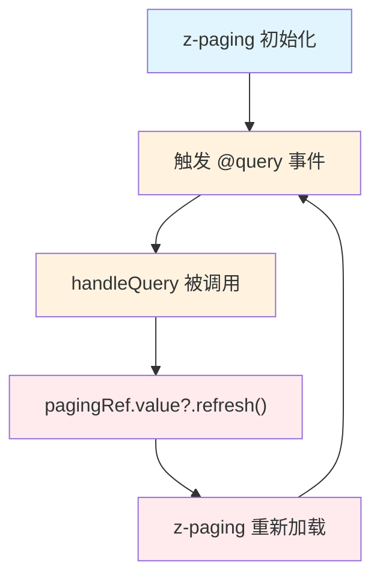

# z-paging 分页组件集成方案

## ⚠️ 多技能协同

**强制组合**（分页功能必须使用）：

- `api-migration` + `api-error-handling`

参阅 `.claude/skills/check-trigger.md` 了解完整的技能触发检查流程。

---

## ⚠️ 集成前必读（Critical）

**🚨 禁止直接编写代码！必须先完成：**

1. ✅ **第一步：阅读参考文件**
   - 必读：`src/pages-sub/repair/pool-list.vue`（完整的 z-paging + useRequest 示例）
   - 必读：`src/pages-sub/repair/staff-todo-list.vue`（复杂筛选 + 分页示例）
   - 必读：本技能文件的完整内容

2. ✅ **第二步：理解核心机制**
   - z-paging 在 `@query` 事件中触发请求
   - useRequest 在 `onSuccess` 中调用 `complete()`
   - 筛选条件变化时调用 `reload()` 重置到第 1 页

3. ✅ **第三步：严格遵循规范**
   - **必须**在 `@query` 中调用 `send()`
   - **必须**在 `onSuccess` 中调用 `complete(list, hasMore)`
   - **必须**在 `onError` 中调用 `complete(false)`
   - **禁止**使用 `try/catch` 包装

### 🚫 常见错误（严禁犯）

|      ❌ 错误写法       |       ✅ 正确写法       |         说明         |
| :--------------------: | :---------------------: | :------------------: |
| 在 `@query` 外调用请求 | 在 `@query` 中 `send()` | 必须在 @query 中触发 |
|    `send().then()`     | `send() + onSuccess()`  | 使用回调而非 Promise |
| 忘记调用 `complete()`  |    `complete(list)`     |  必须通知 z-paging   |
|    手动管理 loading    |        自动管理         | useRequest 自动管理  |

## 1. 适用场景

当页面需要使用 `<z-paging>` 组件实现分页列表功能，同时需要遵循 `api-migration` 规范使用 `useRequest` 管理接口请求时，必须使用本 Skill 中的集成方案。

## 2. 全局配置说明（重要）

### 2.1 常用 props 已全局配置

**⚠️ 重要变更**：以下常用 props 已在 `src/main.ts` 中通过 `uni.$zp.config` 进行全局配置，**无需在每个页面中重复配置**：

|                 配置项                 | 全局默认值 |                      说明                      |
| :------------------------------------: | :--------: | :--------------------------------------------: |
|          `default-page-size`           |     10     |                  每页数据条数                  |
| `auto-hide-loading-after-first-loaded` |   false    | 每次 reload 都显示 loading（便于用户感知刷新） |
|          `refresher-enabled`           |    true    |                  启用下拉刷新                  |
|         `loading-more-enabled`         |    true    |                启用上拉加载更多                |
|            `show-scrollbar`            |   false    |                   隐藏滚动条                   |

**全局配置代码**（`src/main.ts:16-38`）：

```typescript
uni.$zp = {
	config: {
		"default-page-size": 10,
		"auto-hide-loading-after-first-loaded": false,
		"refresher-enabled": true,
		"loading-more-enabled": true,
		"show-scrollbar": false,
	},
};
```

### 2.2 使用规范

**✅ 正确做法**：在页面中**不需要**配置这些 props，直接使用即可：

```vue
<template>
	<!-- ✅ 正确：全局配置自动生效，无需重复配置 -->
	<z-paging ref="pagingRef" v-model="dataList" @query="handleQuery">
		<!-- 列表内容 -->
	</z-paging>
</template>
```

**❌ 错误做法**：重复配置全局已配置的 props：

```vue
<template>
	<!-- ❌ 错误：不要重复配置全局已配置的 props -->
	<z-paging
		ref="pagingRef"
		v-model="dataList"
		:default-page-size="10"
		:refresher-enabled="true"
		:loading-more-enabled="true"
		:show-scrollbar="false"
		@query="handleQuery"
	>
		<!-- 列表内容 -->
	</z-paging>
</template>
```

### 2.3 何时需要覆盖全局配置

**仅在特殊场景下**，如果需要覆盖全局配置，可以显式指定 props：

```vue
<!-- 特殊场景：每页显示 20 条数据 -->
<z-paging ref="pagingRef" v-model="dataList" :default-page-size="20" @query="handleQuery">
	<!-- 列表内容 -->
</z-paging>
```

**常见覆盖场景**：

- 某个列表需要不同的 `default-page-size`
- 需要禁用下拉刷新：`:refresher-enabled="false"`
- 需要显示滚动条：`:show-scrollbar="true"`

### 2.4 其他常用配置

以下 props **未全局配置**，根据需要在页面中配置：

|          配置项          |            说明            |              示例               |
| :----------------------: | :------------------------: | :-----------------------------: |
|         `:fixed`         | 使用固定高度的 scroll-view | `:fixed="false"`（H5 场景推荐） |
| `safe-area-inset-bottom` |       底部安全区适配       |    `safe-area-inset-bottom`     |

## 3. 核心约束

### 3.1 api-migration 规范要求

1. **必须使用 useRequest**：所有接口调用都必须通过 Alova 的 `useRequest` 管理状态
2. **必须设置 immediate: false**：禁止自动执行请求，必须手动触发
3. **必须使用回调钩子**：使用 `onSuccess`、`onError`、`onComplete` 处理请求结果
4. **禁止使用 try/catch**：不允许使用 try/catch 包装 send 函数调用

### 3.2 z-paging 核心机制

|     方法     |        用途        |                       调用时机                        |
| :----------: | :----------------: | :---------------------------------------------------: |
|   `@query`   | 接收分页参数并请求 | z-paging 自动调用（组件挂载时、下拉刷新、上拉加载时） |
| `complete()` |  通知数据加载完成  |                 请求成功或失败后调用                  |
|  `reload()`  |    重新加载数据    |      筛选条件变化、手动刷新时调用，重置到第 1 页      |

## 4. 标准集成方案

### 4.1 核心代码模板

```vue
<template>
	<z-paging ref="pagingRef" v-model="dataList" @query="handleQuery">
		<view v-for="item in dataList" :key="item.id">
			{{ item.name }}
		</view>

		<template #empty>
			<wd-status-tip image="search" tip="暂无数据" />
		</template>
	</z-paging>
</template>

<script setup lang="ts">
import type { YourDataType, YourListParams } from "@/types/your-module";
import { useRequest } from "alova/client";
import { ref } from "vue";
import { getYourDataList } from "@/api/your-module";

/** z-paging 组件引用 */
const pagingRef = ref<ZPagingRef>();

/** 列表数据 */
const dataList = ref<YourDataType[]>([]);

/**
 * 使用 useRequest 管理请求状态 - 链式回调写法
 * @description 必须设置 immediate: false，由 z-paging 控制请求时机
 */
const { loading, send: loadList } = useRequest((params: YourListParams) => getYourDataList(params), {
	immediate: false,
})
	.onSuccess((event) => {
		const result = event.data;
		// 方式一：传入列表，z-paging 自动判断是否有更多
		pagingRef.value?.complete(result.list || []);

		// 方式二：精确控制（如果后端返回 total）
		// pagingRef.value?.completeByTotal(result.list || [], result.total)
	})
	.onError((error) => {
		console.error("加载列表失败:", error);
		pagingRef.value?.complete(false);
	});

/**
 * z-paging 的 @query 回调
 * @description 接收分页参数，触发请求（不使用 await/try-catch）
 */
function handleQuery(pageNo: number, pageSize: number) {
	loadList({
		page: pageNo,
		row: pageSize,
		// 其他筛选参数...
	});
}

/** 手动刷新列表 */
function handleRefresh() {
	pagingRef.value?.reload();
}
</script>
```

### 4.2 带筛选条件的完整示例

```vue
<template>
	<view class="page-container">
		<!-- 搜索栏 -->
		<view class="search-bar">
			<wd-search v-model="searchKeyword" placeholder="搜索..." @search="handleSearch" />
			<wd-button type="primary" size="small" @click="handleSearch"> 搜索 </wd-button>
		</view>

		<!-- 列表 -->
		<z-paging ref="pagingRef" v-model="dataList" @query="handleQuery">
			<view v-for="item in dataList" :key="item.id" class="list-item">
				{{ item.title }}
			</view>

			<template #empty>
				<wd-status-tip image="search" tip="暂无数据" />
			</template>
		</z-paging>
	</view>
</template>

<script setup lang="ts">
import type { RepairOrder, RepairListParams } from "@/types/repair";
import { useRequest } from "alova/client";
import { ref } from "vue";
import { getRepairOrderList } from "@/api/repair";

/** z-paging 组件引用 */
const pagingRef = ref<ZPagingRef>();

/** 列表数据 */
const dataList = ref<RepairOrder[]>([]);

/** 搜索条件 */
const searchKeyword = ref("");
const selectedStatus = ref("");

/**
 * 使用 useRequest 管理请求状态 - 链式回调写法
 */
const { loading, send: loadList } = useRequest((params: RepairListParams) => getRepairOrderList(params), {
	immediate: false,
})
	.onSuccess((event) => {
		const result = event.data;
		pagingRef.value?.complete(result.ownerRepairs || []);
	})
	.onError((error) => {
		console.error("加载列表失败:", error);
		pagingRef.value?.complete(false);
	});

/**
 * z-paging 的 @query 回调
 * @description 将筛选条件合并到请求参数中
 */
function handleQuery(pageNo: number, pageSize: number) {
	loadList({
		page: pageNo,
		row: pageSize,
		repairName: searchKeyword.value || undefined,
		state: selectedStatus.value || undefined,
	});
}

/**
 * 搜索处理
 * @description 重置到第一页并刷新
 */
function handleSearch() {
	pagingRef.value?.reload();
}

/**
 * 筛选条件变化
 */
function handleFilterChange() {
	pagingRef.value?.reload();
}
</script>
```

## 5. 关键适配点

### 5.1 不使用 await/try-catch

```typescript
// 错误：使用 try-catch（违反 api-migration 规范）
async function handleQuery(pageNo: number, pageSize: number) {
	try {
		const result = await loadList({ page: pageNo, row: pageSize });
		pagingRef.value?.complete(result.list);
	} catch {
		pagingRef.value?.complete(false);
	}
}

// 正确：使用回调钩子
function handleQuery(pageNo: number, pageSize: number) {
	loadList({ page: pageNo, row: pageSize });
	// complete 在 onSuccess/onError 回调中调用
}
```

### 5.2 在回调中调用 complete

```typescript
// onSuccess 中处理成功
onSuccess((event) => {
	pagingRef.value?.complete(event.data.list || []);
});

// onError 中处理失败
onError((error) => {
	console.error("加载失败:", error);
	pagingRef.value?.complete(false);
});
```

### 5.3 确保 pagingRef 可用性

由于回调是异步执行的，需要使用可选链确保安全调用：

```typescript
onSuccess((event) => {
	// 使用可选链确保安全调用
	pagingRef.value?.complete(event.data.list || []);
});
```

## 6. complete 方法详解

|             调用方式             |                          说明                           |
| :------------------------------: | :-----------------------------------------------------: |
|         `complete(list)`         | 传入数组，z-paging 根据数组长度自动判断是否还有更多数据 |
|        `complete(false)`         |                     加载失败时调用                      |
|  `completeByTotal(list, total)`  |           传入数组和总数，更精确控制分页状态            |
| `completeByNoMore(list, noMore)` |             传入数组和是否没有更多的布尔值              |

## 7. 常见错误模式

|                  错误模式                   |                  原因                  |              正确做法               |
| :-----------------------------------------: | :------------------------------------: | :---------------------------------: |
|         在 @query 中使用 try/catch          | 违反 api-migration 禁止 try/catch 规范 |     使用 onSuccess/onError 回调     |
|      在 @query 中直接调用 uni.request       |       未使用 useRequest 管理状态       |    使用 useRequest 的 send 方法     |
|            手动管理 loading 状态            |         useRequest 已自动管理          | 直接使用 useRequest 的 loading 状态 |
|        在 onError 中重复显示错误提示        |          全局拦截器已自动处理          |  仅记录日志和调用 complete(false)   |
|   同时使用 `:query` 属性和 `@query` 事件    |            两种绑定方式冲突            |         只选择其中一种方式          |
| 在 @query 回调中调用 `refresh()`/`reload()` |              触发无限循环              |  仅调用 `complete()` 通知加载结果   |
|     使用 @query 时设置 `:auto="false"`      |          阻止自动触发首次加载          |        移除 `:auto="false"`         |
|        `complete()` 传入对象而非数组        |              参数类型错误              |         传入数组或 `false`          |
|   `complete(list, total)` 传入 total 参数   |    z-paging 自动判断，无需传 total     |        `complete(list)` 即可        |

## 7.5 危险模式与陷阱

> **警告**：以下模式会导致页面卡死或严重性能问题，务必避免。

### 7.5.1 属性与事件混用禁忌

z-paging 提供两种查询绑定方式，**必须二选一**，不可混用：

|     用法      |                     正确方式                      |                 错误方式                 |
| :-----------: | :-----------------------------------------------: | :--------------------------------------: |
| `:query` 属性 |     传入查询函数，z-paging 内部调用并管理状态     | 与 `@query` 事件混用，导致重复触发或冲突 |
| `@query` 事件 | 监听查询事件，在回调中执行请求并调用 `complete()` | 在回调中调用 `refresh()`/`reload()` 方法 |

```vue
<!-- 错误：属性和事件混用 -->
<z-paging :query="queryList" @query="handleRefresh"></z-paging>
```

### 7.5.2 无限循环陷阱

在 `@query` 回调中调用 `refresh()` 或 `reload()` 会导致**无限循环**，页面完全卡死：



**错误代码示例**：

```typescript
// 错误：在 @query 回调中调用 refresh，导致无限循环！
function handleQuery(pageNo: number, pageSize: number) {
	currentPage.value = 1;
	pagingRef.value?.refresh(); // ❌ 这会再次触发 @query，形成死循环
}

// 正确：@query 回调只负责发起请求
function handleQuery(pageNo: number, pageSize: number) {
	loadList({
		page: pageNo,
		row: pageSize,
	});
	// complete() 在 onSuccess/onError 回调中调用
}
```

### 7.5.3 `:auto="false"` 配合规则

使用 `@query` 事件时，**不要**设置 `:auto="false"`，否则 z-paging 不会自动触发首次加载：

```vue
<!-- 错误：@query + :auto="false" 会阻止首次加载 -->
<z-paging :auto="false" @query="handleQuery"></z-paging>
```

## 8. immediate: false 必要性

由于 z-paging 会在组件挂载时自动触发 `@query` 事件，因此 `useRequest` 必须设置 `immediate: false`，避免重复请求：

```typescript
const { send: loadList } = useRequest(
	(params) => getDataList(params),
	{ immediate: false }, // 必须设置，由 z-paging 控制请求时机
);
```

## 9. z-paging 的 auto 属性

如果设置 `:auto="false"`，z-paging 不会在挂载时自动触发 `@query`，需要手动调用 `reload()`：

```typescript
onMounted(() => {
	// 手动触发首次加载
	setTimeout(() => {
		pagingRef.value?.reload();
	}, 100);
});
```

## 10. 适配核心原则总结

1. **使用 useRequest 管理请求**：符合 api-migration 规范
2. **在回调钩子中调用 complete**：将 z-paging 的完成通知放在 onSuccess/onError 中
3. **不使用 try/catch**：遵循回调钩子模式
4. **保持职责分离**：错误提示由全局拦截器处理，组件层仅负责日志和 UI 状态

## 11. 代码审查检查点

在代码审查时，针对 z-paging 组件应检查以下事项：

- [ ] 是否同时使用了 `:query` 属性和 `@query` 事件？（禁止混用）
- [ ] `@query` 回调中是否调用了 `refresh()` 或 `reload()`？（会导致无限循环）
- [ ] `complete()` 方法的参数类型是否正确？（应为数组或 `false`）
- [ ] 是否有不必要的 `:auto="false"` 配置？（使用 `@query` 时应移除）
- [ ] `useRequest` 是否设置了 `immediate: false`？（必须设置）
- [ ] 是否使用了 try/catch 包装请求？（违反 api-migration 规范）
- [ ] **是否重复配置了全局已配置的 props**？（如 `default-page-size`、`refresher-enabled` 等，参见第 2 节）

## 12. 相关事故案例

### 2025-12-05 页面卡死事故

**事故文件**：`docs/reports/2025-12-05-z-paging-infinite-loop-bug-report.md`

**影响范围**：选择器模块三个页面（楼栋/单元/房屋选择）完全卡死

**根本原因**：

1. 同时使用 `:query` 属性和 `@query` 事件
2. 在 `@query` 回调中调用 `refresh()` 导致无限循环
3. 使用 `@query` 时设置了 `:auto="false"`

## 13. 实战复用方法论（进页即自动加载）

### 13.1 核心步骤

1. **ref + reload 首屏加载**：定义 `pagingRef = ref()`，在 `onMounted(() => pagingRef.value?.reload())` 触发首屏请求。
2. **useRequest 回调收口**：`immediate: false`，`onSuccess` 里调用 `pagingRef.value?.complete(list, total)`，`onError` 调用 `complete(false)`；不在 `@query` 中写 `await/try/catch`。
3. **@query 只发请求**：`handleQuery(pageNo, pageSize)` 仅调用 `send({ page: pageNo, row: pageSize, ...filters })`，不触发 `reload/refresh`。
4. **全局 props 自动生效**：`default-page-size`、`refresher-enabled`、`loading-more-enabled`、`show-scrollbar` 等常用 props 已全局配置（参见第 2 节），无需重复配置；仅在特殊场景下显式覆盖。根据需要补充 `:fixed`、`safe-area-inset-bottom` 等其他配置。
5. **插槽补全**：提供 `#empty`、`#loading`，避免白屏无反馈。

### 13.2 快速模板

```ts
const pagingRef = ref<ZPagingRef>();
const dataList = ref<Item[]>([]);

const { send: loadList } = useRequest((params) => api(params), { immediate: false })
	.onSuccess((event) => {
		const res = event.data;
		pagingRef.value?.complete(res.list || [], res.total || 0);
	})
	.onError(() => {
		pagingRef.value?.complete(false);
	});

function handleQuery(pageNo: number, pageSize: number) {
	loadList({ page: pageNo, row: pageSize, ...filters });
}

onMounted(() => {
	pagingRef.value?.reload();
});
```

### 13.3 必查清单

- [ ] `immediate: false` 已设置
- [ ] `onSuccess/onError` 调用 `complete/complete(false)` 或 `completeByTotal`
- [ ] `@query` 未使用 `await/try/catch`，未调用 `reload/refresh`
- [ ] `onMounted` 首屏 `reload()`
- [ ] **未重复配置全局已配置的 props**（`default-page-size`、`refresher-enabled`、`loading-more-enabled`、`show-scrollbar` 已全局配置，参见第 2 节）
- [ ] 已使用 `<template #loading>` 插槽
- [ ] 已在 `#loading` 插槽中使用 `z-paging-loading` 组件

## 14. loading 加载状态插槽规范

### 14.1 强制规范

在项目中使用 z-paging 组件时，**必须**遵守以下规范：

1. **必须使用 `<template #loading>` 插槽**
   - 所有使用 z-paging 的页面都必须提供 loading 插槽
   - 不提供 loading 插槽会导致加载状态无提示，用户体验差

2. **必须使用 `z-paging-loading` 组件**
   - 在 `#loading` 插槽内，必须使用 `z-paging-loading` 组件
   - 不允许使用其他加载组件（如 `wd-loading`、自定义加载组件等）
   - 保持项目加载样式的统一性

### 14.2 基础用法

```vue
<template>
	<z-paging ref="pagingRef" v-model="dataList" @query="handleQuery">
		<!-- 加载状态 - 必须提供 -->
		<template #loading>
			<z-paging-loading primary-text="正在加载数据..." />
		</template>

		<!-- 列表内容 -->
		<view v-for="item in dataList" :key="item.id">
			{{ item.title }}
		</view>

		<!-- 空状态 - 建议提供 -->
		<template #empty>
			<wd-status-tip image="search" tip="暂无数据" />
		</template>
	</z-paging>
</template>
```

### 14.3 常用配置场景

#### 14.3.1 楼栋列表加载

```vue
<template #loading>
	<z-paging-loading
		icon="building"
		icon-class="i-carbon-building text-blue-400 animate-pulse"
		primary-text="正在加载楼栋列表..."
		secondary-text="请稍候片刻"
	/>
</template>
```

#### 14.3.2 单元列表加载

```vue
<template #loading>
	<z-paging-loading
		icon="grid"
		icon-class="i-carbon-grid text-green-400 animate-pulse"
		primary-text="正在加载单元列表..."
		secondary-text="请稍候片刻"
	/>
</template>
```

#### 14.3.3 房屋列表加载

```vue
<template #loading>
	<z-paging-loading
		icon="home"
		icon-class="i-carbon-home text-purple-400 animate-pulse"
		primary-text="正在加载房屋列表..."
		secondary-text="请稍候片刻"
	/>
</template>
```

#### 14.3.4 工单列表加载

```vue
<template #loading>
	<z-paging-loading
		icon="document"
		icon-class="i-carbon-document text-orange-400 animate-pulse"
		primary-text="正在加载工单列表..."
		secondary-text="请稍候片刻"
	/>
</template>
```

#### 14.3.5 动态文案（支持搜索状态）

```vue
<template #loading>
	<z-paging-loading
		icon="building"
		icon-class="i-carbon-building text-blue-400 animate-pulse"
		:primary-text="searchValue ? '正在搜索数据...' : '正在加载数据...'"
		secondary-text="请稍候片刻"
	/>
</template>
```

### 14.4 组件属性说明

|    参数名     |             类型              |                 默认值                  |      说明      |
| :-----------: | :---------------------------: | :-------------------------------------: | :------------: |
|     icon      |            string             |                'loading'                |    图标名称    |
|   iconClass   |            string             | 'i-carbon-circle-dash text-blue-400...' | 图标自定义类名 |
|   iconSize    |            string             |                 '20px'                  |    图标大小    |
|  loadingSize  |            string             |                 '32px'                  |   加载器大小   |
|  loadingType  | 'ring'\|'spinner'\|'circular' |                 'ring'                  |   加载器类型   |
|  primaryText  |            string             |            '正在加载数据...'            |    主要文案    |
| secondaryText |            string             |              '请稍候片刻'               |    次要文案    |

### 14.5 使用注意事项

1. **图标选择建议**
   - 建议使用 Carbon 图标库的图标（`i-carbon-*`）保持视觉统一
   - 根据业务场景选择合适的图标（楼栋用 building，房屋用 home，工单用 document 等）

2. **颜色主题建议**
   - 蓝色系（`text-blue-400`）：适用于楼栋、通用数据
   - 绿色系（`text-green-400`）：适用于单元、树形结构数据
   - 紫色系（`text-purple-400`）：适用于房屋、详情数据
   - 橙色系（`text-orange-400`）：适用于工单、警告类数据
   - 青色系（`text-cyan-400`）：适用于用户、人员类数据

3. **文案编写建议**
   - 主文案应简洁明了，说明正在加载的内容类型
   - 支持动态文案，根据搜索状态显示不同提示
   - 副文案可使用通用提示（如"请稍候片刻"）

4. **动画效果**
   - 组件已内置 `animate-pulse` 动画，无需额外配置
   - 加载器会自动旋转，图标会有脉冲效果

### 14.6 完整示例参考

详细的使用示例和各种配置效果，请查看：

- **组件文档**: `src/components/common/z-paging-loading.md`
- **测试页面**: `src/pages/test-use/z-paging-loading.vue`
- **选择器页面**: `src/pages-sub/selector/*.vue`
- **维修工单页面**: `src/pages-sub/repair/order-list.vue`

### 14.7 代码审查检查点

在代码审查时，针对 loading 插槽应检查以下事项：

- [ ] 是否使用了 `<template #loading>` 插槽？
- [ ] 插槽中是否使用了 `z-paging-loading` 组件？
- [ ] 是否使用了其他非规范的加载组件？（如 `wd-loading`、自定义组件等）
- [ ] 主文案是否清晰说明了加载内容？
- [ ] 图标和颜色是否符合业务场景？
- [ ] 是否需要动态文案支持搜索状态？
