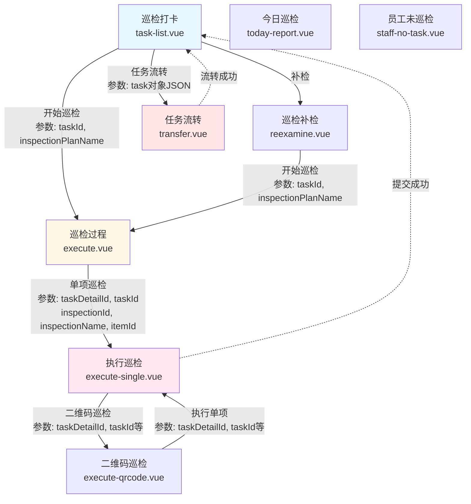

# 巡检管理模块迁移任务清单

**生成时间**: 2025-12-29
**模块**: 巡检管理流程模块 (Inspection Management Module)
**总页面数**: 8 个
**迁移状态**: 🟢 已完成

---

## 一、模块概述

### 1.1 业务说明

巡检管理模块是智慧社区物业管理系统中的核心功能之一,主要用于:

- 物业人员日常巡检任务管理
- 巡检计划执行和过程记录
- 二维码扫码巡检
- 巡检任务流转和补检
- 巡检数据统计和报表

### 1.2 页面关系图

---

## 二、迁移任务清单

### 2.1 任务进度总览

|  序号  |  页面名称  |    新路径文件名    | 优先级 |   状态   |
| :----: | :--------: | :----------------: | :----: | :------: |
| INSP-1 |  巡检打卡  |   task-list.vue    | P0 高  | 🟢已完成 |
| INSP-2 |  今日巡检  |  today-report.vue  | P1 中  | 🟢已完成 |
| INSP-3 | 员工未巡检 | staff-no-task.vue  | P2 低  | 🟢已完成 |
| INSP-4 |  巡检过程  |    execute.vue     | P0 高  | 🟢已完成 |
| INSP-5 |  执行巡检  | execute-single.vue | P0 高  | 🟢已完成 |
| INSP-6 | 二维码巡检 | execute-qrcode.vue | P1 中  | 🟢已完成 |
| INSP-7 |  巡检补检  |   reexamine.vue    | P1 中  | 🟢已完成 |
| INSP-8 |  任务流转  |    transfer.vue    | P1 中  | 🟢已完成 |

**图例说明**:

- 🔴 待办 (Todo)
- 🟡 进行中 (In Progress)
- 🟢 已完成 (Completed)
- ⚠️ 阻塞 (Blocked)

---

### 2.2 详细任务列表

#### INSP-1: 巡检打卡页面迁移

**基本信息**:

|     项目     |                           内容                           |
| :----------: | :------------------------------------------------------: |
|  **旧路径**  |     `gitee-example/pages/inspection/inspection.vue`      |
|  **新路径**  |         `src/pages-sub/inspection/task-list.vue`         |
| **页面功能** |      显示巡检任务列表,支持开始巡检、任务流转、补检       |
| **URL 示例** | `http://localhost:9000/#/pages-sub/inspection/task-list` |
|  **优先级**  |                 P0 (核心功能,最高优先级)                 |
|   **状态**   |                         🔴 待办                          |

**关键功能点**:

- [ ] 巡检任务列表展示
- [ ] 任务状态筛选 (待开始/进行中/已完成)
- [ ] 开始巡检 → 跳转到巡检过程页 (`execute.vue`)
- [ ] 任务流转 → 跳转到任务流转页 (`transfer.vue`)
- [ ] 补检 → 跳转到巡检补检页 (`reexamine.vue`)
- [ ] 下拉刷新和上拉加载

**迁移要点**:

- 使用 `z-paging` 组件实现分页列表
- 使用 `wd-tabs` 实现状态筛选
- 路由跳转时需要传递 `taskId` 和 `inspectionPlanName` 参数
- 任务流转时需要序列化整个 `task` 对象

**依赖关系**:

- 依赖 API: 获取巡检任务列表接口
- 被依赖页面: `execute.vue`, `transfer.vue`, `reexamine.vue`

---

#### INSP-2: 今日巡检页面迁移

**基本信息**:

|     项目     |                            内容                             |
| :----------: | :---------------------------------------------------------: |
|  **旧路径**  | `gitee-example/pages/inspection/inspectionTodayReport.vue`  |
|  **新路径**  |         `src/pages-sub/inspection/today-report.vue`         |
| **页面功能** |                 显示今日巡检统计和详细记录                  |
| **URL 示例** | `http://localhost:9000/#/pages-sub/inspection/today-report` |
|  **优先级**  |                   P1 (重要功能,中优先级)                    |
|   **状态**   |                           🔴 待办                           |

**关键功能点**:

- [ ] 今日巡检统计数据展示
- [ ] 巡检记录列表
- [ ] 日期选择器
- [ ] 数据可视化图表 (可选)

**迁移要点**:

- 使用 `wd-calendar` 或 `wd-datetime-picker` 实现日期选择
- 使用 `wd-card` 展示统计数据
- 考虑使用 ECharts 或 uCharts 实现数据可视化

**依赖关系**:

- 依赖 API: 获取今日巡检统计接口
- 独立页面,无页面依赖

---

#### INSP-3: 员工未巡检页面迁移

**基本信息**:

|     项目     |                             内容                             |
| :----------: | :----------------------------------------------------------: |
|  **旧路径**  |    `gitee-example/pages/inspection/staffNoInspection.vue`    |
|  **新路径**  |         `src/pages-sub/inspection/staff-no-task.vue`         |
| **页面功能** |         显示未完成巡检任务的员工列表,用于督促和提醒          |
| **URL 示例** | `http://localhost:9000/#/pages-sub/inspection/staff-no-task` |
|  **优先级**  |                    P2 (辅助功能,低优先级)                    |
|   **状态**   |                           🔴 待办                            |

**关键功能点**:

- [ ] 未完成巡检的员工列表
- [ ] 员工姓名、所属部门、未完成任务数
- [ ] 催办功能 (可选)
- [ ] 搜索和筛选

**迁移要点**:

- 使用 `z-paging` 组件实现分页列表
- 使用 `wd-search` 实现员工搜索
- 考虑添加一键催办功能

**依赖关系**:

- 依赖 API: 获取未巡检员工列表接口
- 独立页面,无页面依赖

---

#### INSP-4: 巡检过程页面迁移

**基本信息**:

|     项目     |                            内容                             |
| :----------: | :---------------------------------------------------------: |
|  **旧路径**  | `gitee-example/pages/excuteInspection/excuteInspection.vue` |
|  **新路径**  |           `src/pages-sub/inspection/execute.vue`            |
| **页面功能** |        显示巡检任务的详细内容,展示各巡检项的完成情况        |
| **URL 示例** |   `http://localhost:9000/#/pages-sub/inspection/execute`    |
|  **优先级**  |                  P0 (核心功能,最高优先级)                   |
|   **状态**   |                           🔴 待办                           |

**关键功能点**:

- [ ] 巡检任务基本信息展示 (任务名称、计划时间等)
- [ ] 巡检项列表展示 (名称、状态、完成时间)
- [ ] 点击巡检项 → 跳转到执行单项页 (`execute-single.vue`)
- [ ] 巡检进度统计 (已完成/总数)
- [ ] 整体提交巡检任务

**迁移要点**:

- 使用 `wd-steps` 展示巡检进度
- 使用 `wd-cell-group` + `wd-cell` 展示巡检项列表
- 路由跳转时需要传递: `taskDetailId`, `taskId`, `inspectionId`, `inspectionName`, `itemId`
- 考虑使用 `wd-progress` 展示完成度

**依赖关系**:

- 依赖 API: 获取巡检任务详情接口
- 依赖页面: `execute-single.vue` (单项巡检)
- 被依赖页面: `task-list.vue`, `reexamine.vue`

---

#### INSP-5: 执行单项巡检页面迁移

**基本信息**:

|     项目     |                               内容                                |
| :----------: | :---------------------------------------------------------------: |
|  **旧路径**  | `gitee-example/pages/excuteOneInspection/excuteOneInspection.vue` |
|  **新路径**  |           `src/pages-sub/inspection/execute-single.vue`           |
| **页面功能** |              执行单个巡检项,填写巡检结果、上传照片等              |
| **URL 示例** |   `http://localhost:9000/#/pages-sub/inspection/execute-single`   |
|  **优先级**  |                     P0 (核心功能,最高优先级)                      |
|   **状态**   |                              🔴 待办                              |

**关键功能点**:

- [ ] 巡检项详细信息展示 (巡检内容、标准、要求)
- [ ] 巡检结果填写表单 (正常/异常)
- [ ] 异常情况描述文本框
- [ ] 照片上传 (支持多张)
- [ ] 二维码扫码功能 → 跳转到二维码巡检页 (`execute-qrcode.vue`)
- [ ] 提交巡检结果 → 返回巡检过程页

**迁移要点**:

- 使用 `wd-form` 和 `use-wd-form` 技能编写表单
- 使用 `wd-radio-group` 实现巡检结果选择 (正常/异常)
- 使用 `wd-textarea` 实现异常描述输入
- 使用 `wd-upload` 实现照片上传
- 提交后需要更新父页面 (`execute.vue`) 的巡检项状态

**依赖关系**:

- 依赖 API: 提交巡检结果接口
- 依赖页面: `execute-qrcode.vue` (二维码巡检)
- 被依赖页面: `execute.vue`

---

#### INSP-6: 二维码巡检页面迁移

**基本信息**:

|     项目     |                                     内容                                      |
| :----------: | :---------------------------------------------------------------------------: |
|  **旧路径**  | `gitee-example/pages/excuteOneQrCodeInspection/excuteOneQrCodeInspection.vue` |
|  **新路径**  |                 `src/pages-sub/inspection/execute-qrcode.vue`                 |
| **页面功能** |                     通过扫描二维码快速定位到对应的巡检项                      |
| **URL 示例** |         `http://localhost:9000/#/pages-sub/inspection/execute-qrcode`         |
|  **优先级**  |                            P1 (重要功能,中优先级)                             |
|   **状态**   |                                    🔴 待办                                    |

**关键功能点**:

- [ ] 调用摄像头扫描二维码
- [ ] 解析二维码内容获取巡检项信息
- [ ] 跳转到对应的单项巡检页 (`execute-single.vue`)
- [ ] 错误处理 (无效二维码、网络错误等)

**迁移要点**:

- 使用 `uni.scanCode()` 调用扫码功能
- 解析二维码内容,提取 `taskDetailId`, `taskId` 等参数
- 跳转到 `execute-single.vue` 并传递参数
- 添加友好的错误提示

**依赖关系**:

- 依赖 API: 验证二维码有效性接口 (可选)
- 依赖页面: `execute-single.vue`
- 被依赖页面: `execute-single.vue`

---

#### INSP-7: 巡检补检页面迁移

**基本信息**:

|     项目     |                               内容                                |
| :----------: | :---------------------------------------------------------------: |
|  **旧路径**  | `gitee-example/pages/inspectionReexamine/inspectionReexamine.vue` |
|  **新路径**  |             `src/pages-sub/inspection/reexamine.vue`              |
| **页面功能** |            显示需要补检的巡检任务列表,支持发起补检流程            |
| **URL 示例** |     `http://localhost:9000/#/pages-sub/inspection/reexamine`      |
|  **优先级**  |                      P1 (重要功能,中优先级)                       |
|   **状态**   |                              🔴 待办                              |

**关键功能点**:

- [ ] 待补检任务列表展示
- [ ] 任务基本信息 (任务名称、原计划时间、原执行人等)
- [ ] 开始补检 → 跳转到巡检过程页 (`execute.vue`)
- [ ] 补检原因说明

**迁移要点**:

- 使用 `z-paging` 组件实现分页列表
- 使用 `wd-card` 展示任务信息
- 跳转到 `execute.vue` 时需要传递 `taskId` 和 `inspectionPlanName`
- 考虑添加补检原因输入框

**依赖关系**:

- 依赖 API: 获取待补检任务列表接口
- 依赖页面: `execute.vue`
- 被依赖页面: `task-list.vue`

---

#### INSP-8: 任务流转页面迁移

**基本信息**:

|     项目     |                              内容                               |
| :----------: | :-------------------------------------------------------------: |
|  **旧路径**  | `gitee-example/pages/inspectionTransfer/inspectionTransfer.vue` |
|  **新路径**  |             `src/pages-sub/inspection/transfer.vue`             |
| **页面功能** |        将巡检任务流转给其他员工,填写流转原因和选择接收人        |
| **URL 示例** |     `http://localhost:9000/#/pages-sub/inspection/transfer`     |
|  **优先级**  |                     P1 (重要功能,中优先级)                      |
|   **状态**   |                             🔴 待办                             |

**关键功能点**:

- [ ] 任务基本信息展示 (任务名称、当前执行人等)
- [ ] 选择接收人 (支持搜索员工)
- [ ] 流转原因输入框
- [ ] 提交流转 → 返回任务列表页 (`task-list.vue`)

**迁移要点**:

- 使用 `wd-form` 和 `use-wd-form` 技能编写表单
- 使用 `wd-picker` 或员工选择器实现接收人选择
- 使用 `wd-textarea` 实现流转原因输入
- 提交成功后需要刷新任务列表页

**依赖关系**:

- 依赖 API: 提交任务流转接口, 获取员工列表接口
- 被依赖页面: `task-list.vue`

---

## 三、迁移实施计划

### 3.1 迁移顺序建议

基于页面依赖关系和优先级,建议按以下顺序进行迁移:

**第一批 (核心流程)**: P0 优先级

1. INSP-1: 巡检打卡 (`task-list.vue`) - 入口页面
2. INSP-4: 巡检过程 (`execute.vue`) - 核心流程
3. INSP-5: 执行单项巡检 (`execute-single.vue`) - 核心流程

**第二批 (重要功能)**: P1 优先级 4. INSP-8: 任务流转 (`transfer.vue`) 5. INSP-7: 巡检补检 (`reexamine.vue`) 6. INSP-6: 二维码巡检 (`execute-qrcode.vue`) 7. INSP-2: 今日巡检 (`today-report.vue`)

**第三批 (辅助功能)**: P2 优先级 8. INSP-3: 员工未巡检 (`staff-no-task.vue`)

### 3.2 技术栈要求

- **框架**: Vue 3 Composition API + TypeScript
- **组件库**: wot-design-uni
- **状态管理**: Pinia (如需跨页面状态)
- **HTTP 请求**: Alova + Mock 接口
- **分页组件**: z-paging
- **样式**: UnoCSS + SCSS

### 3.3 迁移技能文件参考

在迁移过程中,请务必遵守以下技能文件的要求:

- ✅ `code-migration` - Vue2 到 Vue3 代码写法迁移
- ✅ `component-migration` - wot-design-uni 组件使用规范
- ✅ `route-migration` - 路由配置和跳转规范
- ✅ `style-migration` - UnoCSS 样式迁移
- ✅ `api-migration` - Alova + Mock 接口规范
- ✅ `api-error-handling` - 接口错误提示规范
- ✅ `z-paging-integration` - 分页组件集成方案
- ✅ `use-wd-form` - 表单组件编写规范
- ✅ `beautiful-component-design` - 移动端组件美化规范

---

## 四、API 接口清单 (Mock 接口)

### 4.1 需要实现的 Mock 接口

|  接口名称  |       功能描述        | 请求方法 |             接口路径              |
| :--------: | :-------------------: | :------: | :-------------------------------: |
| API-INS-1  |   获取巡检任务列表    |   GET    |      `/api/inspection/tasks`      |
| API-INS-2  |   获取巡检任务详情    |   GET    |    `/api/inspection/task/:id`     |
| API-INS-3  |   提交单项巡检结果    |   POST   |   `/api/inspection/submit-item`   |
| API-INS-4  |   提交整体巡检任务    |   POST   |   `/api/inspection/submit-task`   |
| API-INS-5  |     提交任务流转      |   POST   |    `/api/inspection/transfer`     |
| API-INS-6  |  获取待补检任务列表   |   GET    | `/api/inspection/reexamine-tasks` |
| API-INS-7  |   获取今日巡检统计    |   GET    |  `/api/inspection/today-report`   |
| API-INS-8  |  获取未巡检员工列表   |   GET    |  `/api/inspection/staff-no-task`  |
| API-INS-9  |     获取员工列表      |   GET    |         `/api/staff/list`         |
| API-INS-10 | 验证巡检二维码 (可选) | POST/GET |  `/api/inspection/verify-qrcode`  |

### 4.2 数据结构参考

请在实现 Mock 接口时,参考 Vue2 旧项目的真实数据结构。

---

## 五、注意事项和风险提示

### 5.1 关键注意事项

1. **参数传递**:
   - 任务流转时需要序列化整个 `task` 对象,而不是只传递 `taskId`
   - 单项巡检需要传递多个参数: `taskDetailId`, `taskId`, `inspectionId`, `inspectionName`, `itemId`

2. **状态同步**:
   - 单项巡检提交后,需要及时更新巡检过程页的状态
   - 任务流转成功后,需要刷新任务列表页

3. **照片上传**:
   - 注意文件大小限制和格式校验
   - 考虑图片压缩优化上传速度

4. **二维码扫描**:
   - 需要处理各种异常情况 (无权限、无效二维码、网络错误等)
   - 考虑添加手动输入二维码编号的备用方案

### 5.2 潜在风险

| 风险项 |            风险描述            | 风险等级 |         应对措施          |
| :----: | :----------------------------: | :------: | :-----------------------: |
| 风险-1 |  Vue2 旧代码逻辑复杂,难以理解  |   🟡中   | 充分阅读旧代码,绘制流程图 |
| 风险-2 | 参数传递方式不一致导致数据丢失 |   🔴高   |  严格按照迁移映射表进行   |
| 风险-3 |    照片上传功能适配不同平台    |   🟡中   |   充分测试 H5 和小程序    |
| 风险-4 |    Mock 接口数据结构不准确     |   🟡中   |  参考旧项目真实接口数据   |

---

## 六、测试计划

### 6.1 功能测试清单

- [ ] 巡检任务列表正常展示
- [ ] 任务状态筛选功能正常
- [ ] 开始巡检流程完整可用
- [ ] 单项巡检表单提交成功
- [ ] 照片上传功能正常
- [ ] 二维码扫描功能正常
- [ ] 任务流转功能正常
- [ ] 补检功能正常
- [ ] 今日巡检统计数据正确
- [ ] 员工未巡检列表正常

### 6.2 平台兼容性测试

- [ ] H5 平台测试
- [ ] 微信小程序测试
- [ ] APP 测试 (可选)

---

## 七、迁移进度记录

### 7.1 进度跟踪

|    日期    | 完成任务 |                           进度说明                           | 遗留问题 |
| :--------: | :------: | :----------------------------------------------------------: | :------: |
| 2025-12-29 |   0/8    |                       创建迁移任务清单                       |    无    |
| 2025-12-29 |   8/8    | **✅ 全部页面迁移完成！已创建所有 8 个 Vue3 页面和类型定义** |    无    |

### 7.2 完成标准

每个页面迁移完成需满足以下条件:

- ✅ 代码通过 ESLint 检查
- ✅ 代码通过 TypeScript 类型检查
- ✅ 页面功能与 Vue2 旧项目一致
- ✅ H5 和小程序平台测试通过
- ✅ Mock 接口联调通过
- ✅ 代码审查通过

---

## 八、参考资料

### 8.1 项目文档

- Vue2 路由跳转关系脑图: `docs\reports\vue2-route-navigation-map.md`
- Vue2 到 Vue3 路由映射表: `.github\prompts\route-migration-map.yml`

### 8.2 技能文件

- `.claude\skills\code-migration\SKILL.md`
- `.claude\skills\component-migration\SKILL.md`
- `.claude\skills\route-migration\SKILL.md`
- `.claude\skills\style-migration\SKILL.md`
- `.claude\skills\api-migration\SKILL.md`
- `.claude\skills\api-error-handling\SKILL.md`
- `.claude\skills\z-paging-integration\SKILL.md`
- `.claude\skills\use-wd-form\SKILL.md`
- `.claude\skills\beautiful-component-design\SKILL.md`

### 8.3 组件库文档

- wot-design-uni 官方文档: https://wot-ui.cn/guide/quick-use.html
- wot-design-uni GitHub: https://github.com/Moonofweisheng/wot-design-uni

---

**最后更新时间**: 2025-12-29
**维护人**: Claude Code AI Assistant
