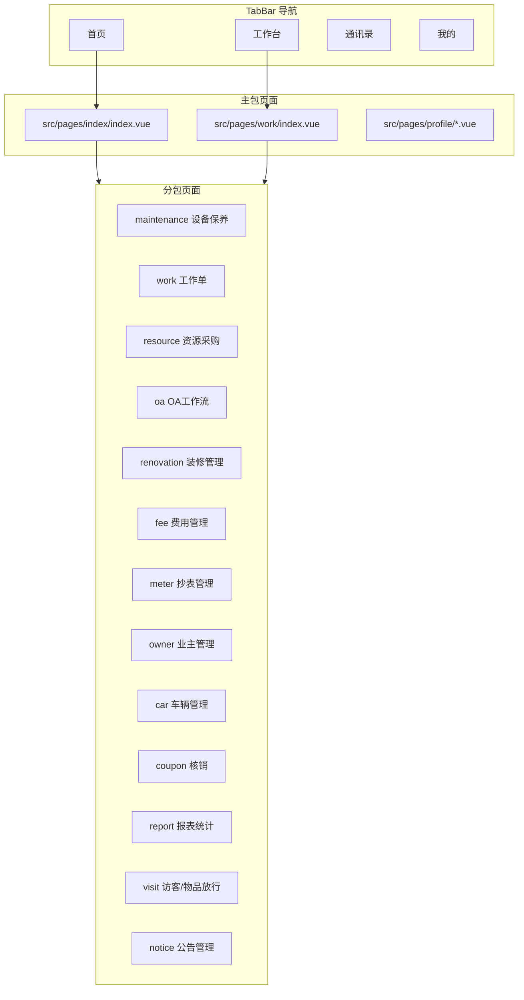

# Design Document

## Overview

本设计文档定义了首页/工作台模块迁移的技术架构和实现方案。迁移涉及 **80+ 个页面**，分布在 **14 个业务模块**中。

### 迁移范围

| 优先级 | 模块名称          | 页面数量 | 分包路径                     |
| :----: | :---------------- | :------: | :--------------------------- |
|   P0   | 工作台页面        |    1     | `src/pages/work/`            |
|   P0   | 首页入口完善      |    1     | `src/pages/index/`           |
|   P1   | 设备保养模块      |    4     | `src/pages-sub/maintenance/` |
|   P1   | 工作单模块        |    8     | `src/pages-sub/work/`        |
|   P1   | 资源采购管理模块  |   20+    | `src/pages-sub/resource/`    |
|   P2   | OA 工作流模块     |    7     | `src/pages-sub/oa/`          |
|   P2   | 装修管理模块      |    5     | `src/pages-sub/renovation/`  |
|   P2   | 费用管理模块      |    6     | `src/pages-sub/fee/`         |
|   P2   | 抄表管理模块      |    6     | `src/pages-sub/meter/`       |
|   P3   | 业主管理模块      |    3     | `src/pages-sub/owner/`       |
|   P3   | 车辆管理模块      |    5     | `src/pages-sub/car/`         |
|   P3   | 核销模块          |    5     | `src/pages-sub/coupon/`      |
|   P3   | 报表统计模块      |    6     | `src/pages-sub/report/`      |
|   P3   | 访客/物品放行模块 |    4     | `src/pages-sub/visit/`       |
|   P3   | 公告管理模块      |    2     | `src/pages-sub/notice/`      |
|   P3   | 个人中心相关      |    4     | `src/pages/profile/`         |

### 技术栈

- **框架**: uni-app 3.x (Vue3 + TypeScript)
- **UI 组件库**: wot-design-uni
- **样式方案**: UnoCSS + SCSS
- **请求库**: Alova + useRequest
- **分页组件**: z-paging
- **状态管理**: Pinia

## Architecture

### 整体架构图



````plain

### 目录结构

```plain
src/
├── pages/
│   ├── index/
│   │   └── index.vue          # 首页（完善入口跳转）
│   ├── work/
│   │   └── index.vue          # 工作台页面（新建）
│   └── profile/
│       ├── change-community.vue  # 切换小区
│       └── change-password.vue   # 修改密码
├── pages-sub/
│   ├── maintenance/           # 设备保养模块
│   │   ├── index.vue          # 设备保养列表
│   │   ├── execute.vue        # 保养执行
│   │   ├── execute-single.vue # 单项保养
│   │   └── transfer.vue       # 任务流转
│   ├── work/                  # 工作单模块
│   │   ├── start.vue          # 发工作单
│   │   ├── do.vue             # 办工作单
│   │   ├── copy.vue           # 抄送工作单
│   │   ├── detail.vue         # 工作单详情
│   │   ├── edit.vue           # 修改工作单
│   │   ├── audit.vue          # 工作单审核
│   │   ├── task-list.vue      # 工作单任务
│   │   └── do-copy.vue        # 已阅
│   ├── resource/              # 资源采购管理模块
│   │   ├── purchase-audit.vue       # 采购待办
│   │   ├── item-out-audit.vue       # 领用待办
│   │   ├── allocation-audit.vue     # 调拨待办
│   │   ├── purchase-manage.vue      # 采购申请管理
│   │   ├── add-purchase.vue         # 添加采购申请
│   │   ├── edit-purchase.vue        # 修改采购申请
│   │   ├── purchase-detail.vue      # 采购申请详情
│   │   ├── item-out-manage.vue      # 物品领用管理
│   │   ├── add-item-out.vue         # 领用申请
│   │   ├── item-out-do.vue          # 物品发放
│   │   ├── item-enter-do.vue        # 物品入库
│   │   ├── allocation-manage.vue    # 调拨管理
│   │   ├── allocation-apply.vue     # 物品调拨
│   │   ├── allocation-detail.vue    # 调拨详情
│   │   ├── allocation-enter.vue     # 调拨入库
│   │   ├── my-items.vue             # 我的物品
│   │   ├── store-return.vue         # 物品退还
│   │   ├── store-scrap.vue          # 物品损耗
│   │   └── store-transfer.vue       # 物品转赠
│   └── ...                    # 其他模块
├── api/
│   ├── maintenance.ts         # 设备保养 API
│   ├── work-order.ts          # 工作单 API
│   ├── resource.ts            # 资源采购 API
│   └── mock/
│       ├── maintenance.mock.ts
│       ├── work-order.mock.ts
│       └── resource.mock.ts
└── types/
    ├── maintenance.ts         # 设备保养类型
    ├── work-order.ts          # 工作单类型
    └── resource.ts            # 资源采购类型
````

## Components and Interfaces

### 1. 工作台页面组件

```typescript
// src/pages/work/index.vue
interface WorkbenchMenu {
	id: string;
	name: string;
	icon: string;
	iconClass: string;
	route: string;
	badge?: number;
	disabled?: boolean;
}

interface WorkbenchCategory {
	title: string;
	menus: WorkbenchMenu[];
}
```

### 2. 首页入口组件

```typescript
// src/pages/index/index.vue
interface HeaderEntry {
	id: string;
	name: string;
	icon: string;
	iconClass: string;
	route: string;
	badge?: number;
}

interface TodoEntry {
	id: string;
	name: string;
	route: string;
	count: number;
}
```

### 3. 通用列表页组件结构

```vue
<template>
	<z-paging ref="pagingRef" v-model="dataList" @query="handleQuery">
		<template #loading>
			<z-paging-loading :primary-text="loadingText" />
		</template>

		<view v-for="item in dataList" :key="item.id">
			<!-- 列表项内容 -->
		</view>

		<template #empty>
			<wd-status-tip image="search" tip="暂无数据" />
		</template>
	</z-paging>
</template>
```

### 4. 通用表单页组件结构

```vue
<template>
	<view class="page-container">
		<wd-form ref="formRef" :model="model" :rules="formRules">
			<wd-cell-group border>
				<FormSectionTitle title="基本信息" icon="document" />
				<!-- 表单项 -->
			</wd-cell-group>

			<view class="mt-6 px-3 pb-6">
				<wd-button block type="success" size="large" @click="handleSubmit"> 提交 </wd-button>
			</view>
		</wd-form>
	</view>
</template>
```

## Data Models

### 1. 设备保养模块

```typescript
// src/types/maintenance.ts

/** 设备保养任务 */
export interface MaintenanceTask {
	taskId: string;
	taskName: string;
	machineName: string;
	machineId: string;
	planTime: string;
	status: string;
	statusName: string;
	staffId?: string;
	staffName?: string;
	communityId: string;
}

/** 保养任务详情 */
export interface MaintenanceTaskDetail {
	taskDetailId: string;
	taskId: string;
	itemName: string;
	itemContent: string;
	result?: string;
	remark?: string;
	photos?: string[];
}

/** 保养任务查询参数 */
export interface MaintenanceQueryParams {
	page: number;
	row: number;
	communityId: string;
	status?: string;
}
```

### 2. 工作单模块

```typescript
// src/types/work-order.ts

/** 工作单 */
export interface WorkOrder {
	workId: string;
	workName: string;
	workContent: string;
	createTime: string;
	status: string;
	statusName: string;
	createUserId: string;
	createUserName: string;
	handleUserId?: string;
	handleUserName?: string;
	communityId: string;
}

/** 工作单任务 */
export interface WorkTask {
	taskId: string;
	workId: string;
	taskName: string;
	taskContent: string;
	status: string;
	assigneeId: string;
	assigneeName: string;
}

/** 工作单查询参数 */
export interface WorkOrderQueryParams {
	page: number;
	row: number;
	communityId: string;
	status?: string;
	workName?: string;
}
```

### 3. 资源采购模块

```typescript
// src/types/resource.ts

/** 采购申请 */
export interface PurchaseApply {
	applyId: string;
	applyName: string;
	applyUserId: string;
	applyUserName: string;
	applyTime: string;
	status: string;
	statusName: string;
	totalAmount: number;
	items: PurchaseItem[];
	communityId: string;
}

/** 采购物品 */
export interface PurchaseItem {
	itemId: string;
	itemName: string;
	quantity: number;
	unitPrice: number;
	amount: number;
	specification?: string;
}

/** 物品领用 */
export interface ItemOut {
	outId: string;
	itemId: string;
	itemName: string;
	quantity: number;
	outUserId: string;
	outUserName: string;
	outTime: string;
	status: string;
	statusName: string;
}

/** 调拨申请 */
export interface AllocationApply {
	applyId: string;
	fromStoreId: string;
	fromStoreName: string;
	toStoreId: string;
	toStoreName: string;
	applyUserId: string;
	applyUserName: string;
	applyTime: string;
	status: string;
	items: AllocationItem[];
}
```

## Correctness Properties

_A property is a characteristic or behavior that should hold true across all valid executions of a system-essentially, a formal statement about what the system should do. Properties serve as the bridge between human-readable specifications and machine-verifiable correctness guarantees._

Based on the prework analysis, the following correctness properties are identified:

### Property 1: Navigation Entry Click Behavior

_For any_ navigation entry (header entry, work todo entry, or work order entry) on the index page or workbench page, clicking it should either:

- Navigate to the correct target page (if the module is migrated), OR
- Display a "功能开发中" toast message (if the module is not yet migrated)

**Validates: Requirements 1.3, 2.5, 2.6, 2.7**

### Property 2: API Response Format Conformance

_For any_ Mock API endpoint, the response should conform to the `ApiResponse<T>` structure:

```typescript
{
	success: boolean;
	code: string;
	message: string;
	data: T;
	timestamp: number;
}
```

**Validates: Requirements 17.2**

### Property 3: Pagination Response Format Conformance

_For any_ Mock API endpoint that returns list data, the response data should conform to the `PaginationResponse<T>` structure:

```typescript
{
  list: T[]
  total: number
  page: number
  pageSize: number
  hasMore: boolean
}
```

**Validates: Requirements 17.3**

### Property 4: z-paging Complete Callback Behavior

_For any_ z-paging list page, when the API request succeeds, the complete() method should be called with the list data; when the API request fails, the complete(false) method should be called.

**Validates: Requirements 23.2, 23.3**

### Property 5: Dynamic Page Title Setting

_For any_ page that requires dynamic title based on URL parameters or business state, calling uni.setNavigationBarTitle in onReady should correctly set the navigation bar title to the computed value.

**Validates: Requirements 26.1, 26.2, 26.3**

### Property 6: TypedRouter Navigation Consistency

_For any_ page navigation using TypedRouter methods, the navigation should reach the correct target page with the correct parameters, and the parameters should match the PageParams type definition.

**Validates: Requirements 18.2, 18.3, 18.4, 18.5**

## Error Handling

### 1. 全局错误处理

所有 API 请求错误由 `src/http/alova.ts` 的响应拦截器统一处理：

- HTTP 状态码错误：自动显示对应错误提示
- 业务逻辑错误：自动显示业务错误信息
- 网络错误：显示网络异常提示

### 2. 组件层错误处理

```typescript
const { send: loadList } = useRequest((params) => getMaintenanceList(params), { immediate: false })
	.onSuccess((event) => {
		pagingRef.value?.complete(event.data.list || []);
	})
	.onError((error) => {
		console.error("加载失败:", error);
		pagingRef.value?.complete(false);
	});
```

### 3. 表单提交错误处理

```typescript
const { send: submitForm, loading: submitting } = useRequest((data) => createWorkOrder(data), { immediate: false })
	.onSuccess(() => {
		toast.success("提交成功");
		setTimeout(() => uni.navigateBack(), 1500);
	})
	.onError((error) => {
		console.error("提交失败:", error);
		// 全局拦截器已自动显示错误提示
	});
```

## Testing Strategy

### 1. 单元测试

- 测试工具函数的正确性
- 测试类型定义的完整性
- 测试常量配置的正确性

### 2. 属性测试（Property-Based Testing）

使用 `fast-check` 库进行属性测试：

**Property 1 测试 - Navigation Entry Click Behavior**：

- 生成随机的导航入口配置（包含 route、disabled、migrated 属性）
- 模拟点击事件
- 验证：已迁移模块导航到正确页面，未迁移模块显示 Toast 提示

**Property 2 测试 - API Response Format Conformance**：

- 调用所有 Mock API 端点
- 验证响应结构符合 `ApiResponse<T>`（包含 success、code、message、data、timestamp 字段）

**Property 3 测试 - Pagination Response Format Conformance**：

- 调用所有返回列表的 Mock API 端点
- 验证响应数据符合 `PaginationResponse<T>`（包含 list、total、page、pageSize、hasMore 字段）

**Property 4 测试 - z-paging Complete Callback Behavior**：

- 生成随机的分页参数（page、row）
- 模拟 API 请求成功和失败场景
- 验证：成功时 complete(list) 被调用，失败时 complete(false) 被调用

**Property 5 测试 - Dynamic Page Title Setting**：

- 生成随机的 URL 参数（如 action: DISPATCH/TRANSFER/BACK/FINISH）
- 模拟 onReady 生命周期
- 验证：uni.setNavigationBarTitle 被调用且 title 参数正确

**Property 6 测试 - TypedRouter Navigation Consistency**：

- 生成随机的路由路径和参数
- 调用 TypedRouter 方法
- 验证：导航到正确页面，参数正确传递

### 3. 集成测试

- 测试页面路由跳转的正确性
- 测试表单提交流程
- 测试列表分页功能

### 4. 测试框架

- **属性测试库**: fast-check
- **测试运行器**: vitest
- **测试配置**: 每个属性测试运行 100 次迭代
- **测试标注格式**: `**Feature: home-workbench-migration, Property {number}: {property_text}**`
